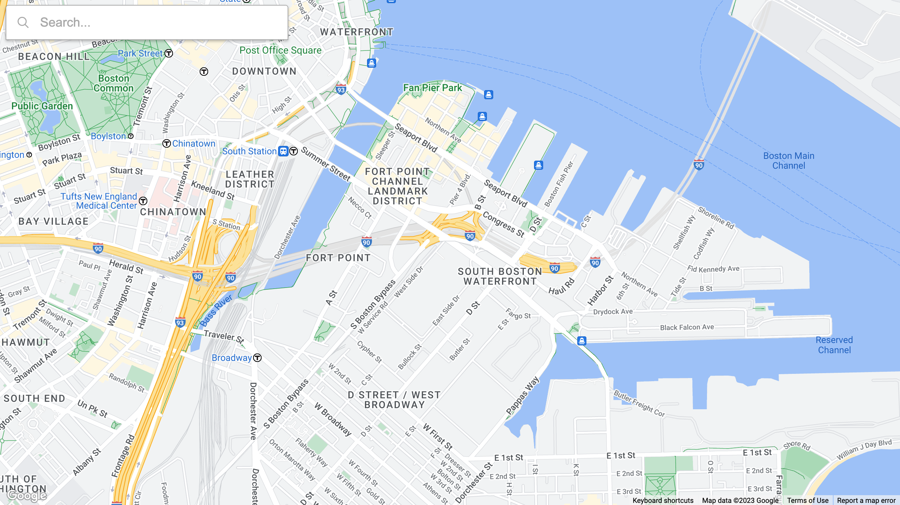
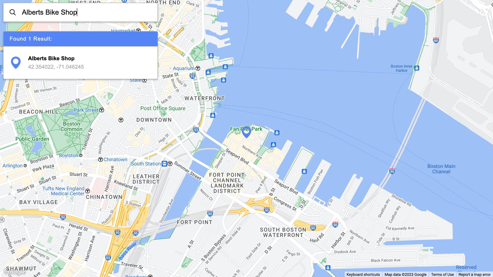
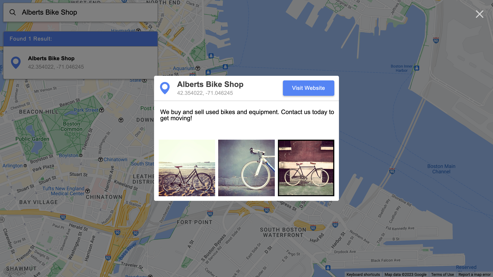
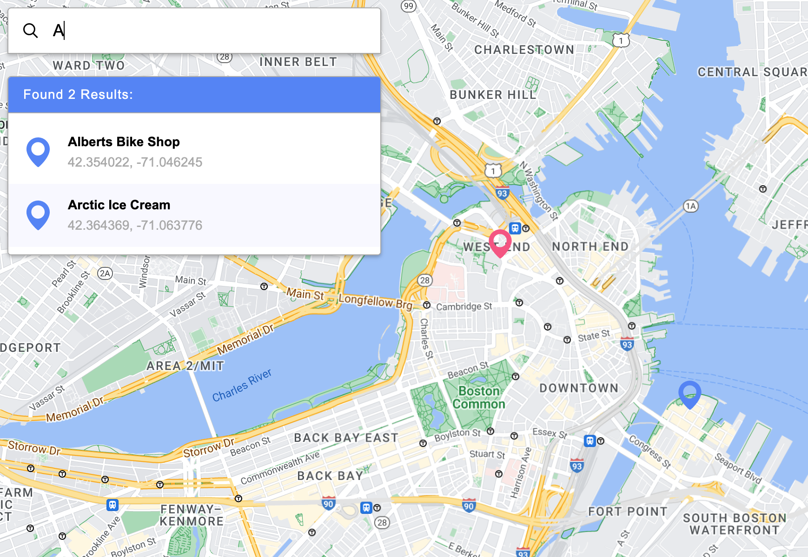
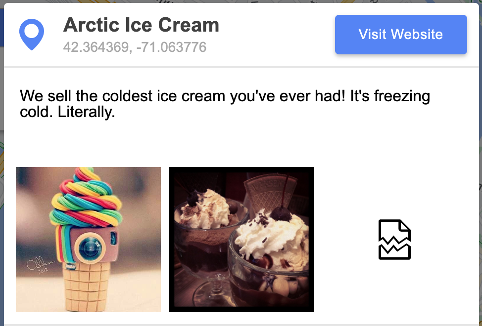
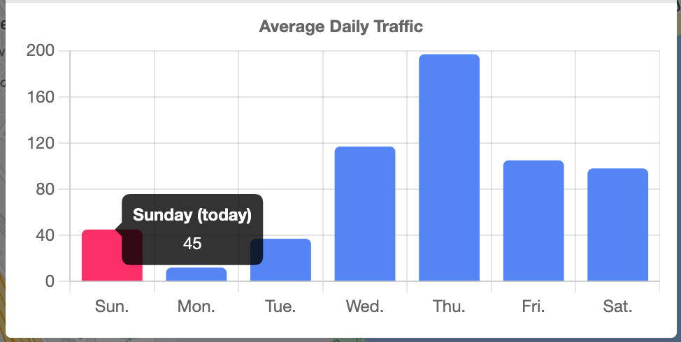

# Map App

[Live link](https://masonanders.github.io/map-app/)

Search for results on a Google Maps interface and find further details including pictures and traffic data.

This was built as part of a coding challenge which provided requirements, design specs, assets, and sample data. Core technologies are [React](https://react.dev/), [TypeScript](https://www.typescriptlang.org/), and [Styled Components](https://styled-components.com/).

## Requirements

### Features

- Create a map-based application using the Google Maps API.
- On top of the map interface should be a `Searchbar` where users can provide text input.
- As the user types into the `Searchbar`, a list of results matching the query should populate underneath the `Searchbar`; if no results match the input, a message should indicate as-such.
- When a result within the list is clicked, the Map should focus on the result's location with a Pin marking the location.
- When the pin is clicked, a modal should open and display a detailed view of the corresponding result's data.

### Specs

## Extra Features

Beyond the required features, I opted to introduce my own flair through features where I thought they made sense.

### Multiple Results Pins & Highlight On-Hover

When multiple data-points match the user-input in the `Searchbar`, it is expected that multiple results appear in the `Results` list. I thought it made sense to render these results to the Map as well. Upon updating `results`, a new map boundary is calculated to include all result pins and when a result is hovered, the corresponding pin changes its `fill` color to a contrasting color.

### Modal Close On Click-Away

The provided specs showed a close button on the modal background. However, as far as I am aware it's a standard UX pattern for modals to close when you click on either the background or close button. So I implemented this by putting a click handler on the modal background and then another on the modal box itself that stops event propagation so the modal doesn't close when users interact with the main UI.

### Missing Data

The data-points provided always have an `id`, `name`, and `position`. However, there are a number of other fields that don't exist on all data-points. So I designed the modal implementation to account for that and only render UI for data that exists on the relevant result.

### Broken images

There are some images provided in the `sample-data` that fail to load. So I added a spinner animation for images while they are loading as well as a fallback to a broken-file icon when the image fails to load.

### Average Daily Traffic Chart

Some results contain data for the average daily traffic. So I implemented a chart using `Chart.js` to illustrate this data. Columns are labeled by their abbreviated day-value. When a column is hovered, it is labeled by its full-day value. The current day is highlighted by a contrasting color and its tooltip label is appended with `(today)`.

## Implementation

I opted to use React as this was the core frontend framework for the organization I was completing the coding challenge for. I built this in TypeScript since I anticipated this project being a large enough in scale to benefit from the more restricted nature of TypeScript. Lastly, I brought in Styled Components as there were some cases where passing parameters to dynamically generated classes would make development easier.

Using the Google Maps API was part of the coding challenge. Rather than bringing in a React-specific library to handle rendering the Google Map interface I opted to handle it myself with the help of `@googlemaps/js-api-loader` to minimize the number of dependencies.

### File Structure

- `src` - Root of the React application
  - `assets` - Raw icons
  - `components` - Reusable/extendable React components
  - `contexts` - React context definitions and providers
  - `data` - Sample data
  - `layouts` - Main UI components
  - `theme` - Project global theme definitions and helpers
  - `utils` - Case-agnostic utilities

### State

In order to keep the code clean and minimal, I opted to use React Contexts to pass state between the main sections of the UI versus tracking that state in `App.tsx` and passing it through several series of component props. That ended up being the reference to the `map` object as well as the results being interacted with.

I still pass state through props where it makes sense, such a the `searchValue` for the `Searchbar` which affects the results calculated by `Results`. Since they are both siblings within the `SearchOverlay` and that value is not used anywhere else.

### Handling The Map

The Map is initialized by the `GoogleMap` component and the `map` object, which is used to control the Map, is passed to a React Context at the root-level. This `map` object is then used by the `ResultsMapManager` to render pins that correspond to results within `Results`.

Due to how the Google Maps API is loaded at runtime onto the global scope after initialization, it is necessary to confirm the map is loaded any time the Google Maps API is accessed.

In order to render custom markers on the Map from `.svg` files, it is necessary to extract the SVG path to provide to the Google Maps API. One way I solved this was to render the SVG to the DOM and then select it and get its `path` attribute. However, a solution I found online was to bring in a library that allowed importing raw files and then using the `DOMParser` to get the SVG `path` attribute without rendering it to the DOM.

### Search Logic

At first I started with filtering by results that included the `serachValue` in its name. However, that lead so some unintuitive results, especially when searching by common letters like `e` and `s`. So I updated it to filter by words within the result name that start with the `searchValue`. That worked well until I found a bug that rendered no results when providing a multi-word query, since no one word will ever start with multiple words. So I landed on using both strategies, if the `searchValue` has multiple words, I filter by names that include the entire `searchValue` and if there is only one word then I split the result name and check to see if any start with `searchValue`.
